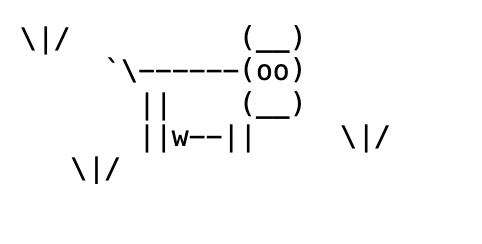

# Return Ready Lab 06
* Part A - Foundations 2.1
* Part B - Foundations 2.2
* Part C - Instructors Challenge


## Part A

Using the sample email below:

What's up homie,

We have a project coming up in class this week. We need to form groups of 5. If you decide to join our group, we would need one more person. None of us are good with switch statements yet, if you could find one more person thats good with those we would be set.

Also, since we need to meet remotely could you request that the teachers let us use their professional zoom account?

Thanks <br>
Raekwon The Chef

**Step 01**

Use this template for a [Sprial Requirements Chart](https://docs.google.com/document/d/1qFuQsuEwolJd2ZnLnjmLYhHHR0b1rztGheU7hnXRdxM/edit?usp=sharing). Save a copy to your personal accounts, and complete the assignment using the email above. When you complete the document, save a copy as pdf
locally in the part_a/documents folder of this project, so it can be included in your git repo.

**Step 02**

Imagine what might happen to if a particular step were forgoten.

Use this template again for a [Sprial Requirements Chart](https://docs.google.com/document/d/1qFuQsuEwolJd2ZnLnjmLYhHHR0b1rztGheU7hnXRdxM/edit?usp=sharing). Save a copy to your personal accounts, and complete the assignment using the email above. When you complete the part_a/documents, save a copy as pdf locally in the documents folder of this project, so it can be included in your git repo.


**Step 03**

The past weekend you built a calculator, create a sprial document for the calculator, adding new features:

* SIN
* COS
* SQUARE ROOT

Use this template again for a [Sprial Requirements Chart](https://docs.google.com/document/d/1qFuQsuEwolJd2ZnLnjmLYhHHR0b1rztGheU7hnXRdxM/edit?usp=sharing). Save a copy to your personal accounts, and complete the assignment using the email above.When you complete the part_a/documents, save a copy as pdf locally in the documents folder of this project, so it can be included in your git repo.

## Part B

### Step 01

In the `part_b.examples.example01` package take a look at the `Text01` file , comment all the lines and run it.

### Step 02

In the `part_b.activities.activity01` package complete the class `LetterA` so that its output looks like below:


### Step 03

In the `part_b.examples.example02` uncomment the main method in `Text02`. Fix all the errors.


### Step 04

In the `part_b.examples.example03` use the method `drawLegs` to add legs to the kitty.

Can you convert the rest of the main method to a method? How would you do it?

### Step 05

In the package `part_b.examples.example02` complete the class `SimpleCow` so that its output looks like below:



### Step 06

In the package `part_b.examples.example02` complete the class `SimpleCow` so that its output looks like below:


## Part C

**AsciiAlphabet**

Complete AsciiAlphabet - create an application that takes in a word from the user, then converts it to ASCII art like below:

```
Welcome to ASCII Alphabet:
Please enter a single word to be converted:
Wutang

Your word in ASCII Art:

#     # 
#  #  # 
#  #  # 
#  #  # 
#  #  # 
#  #  # 
 ## ## 

#     # 
#     # 
#     # 
#     # 
#     # 
#     # 
 #####  

####### 
   #    
   #    
   #    
   #    
   #    
   #   

   #    
  # #   
 #   #  
#     # 
####### 
#     # 
#     # 

#     # 
##    # 
# #   # 
#  #  # 
#   # # 
#    ## 
#     # 

 #####  
#     # 
#       
#  #### 
#     # 
#     # 
 ##### 

```